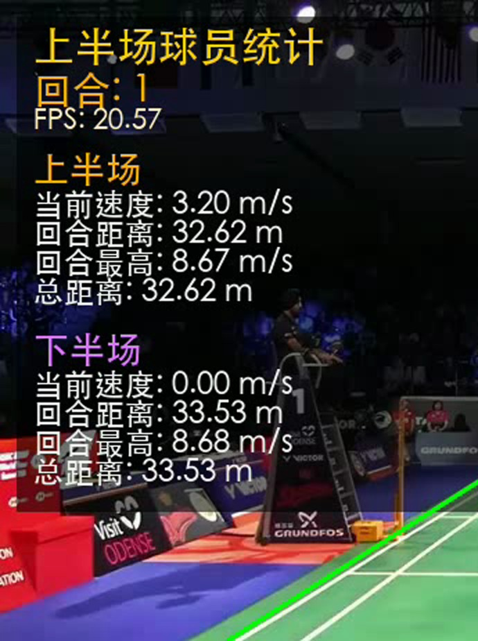
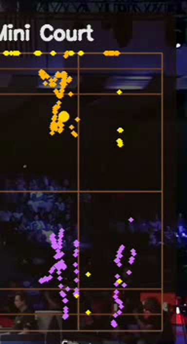
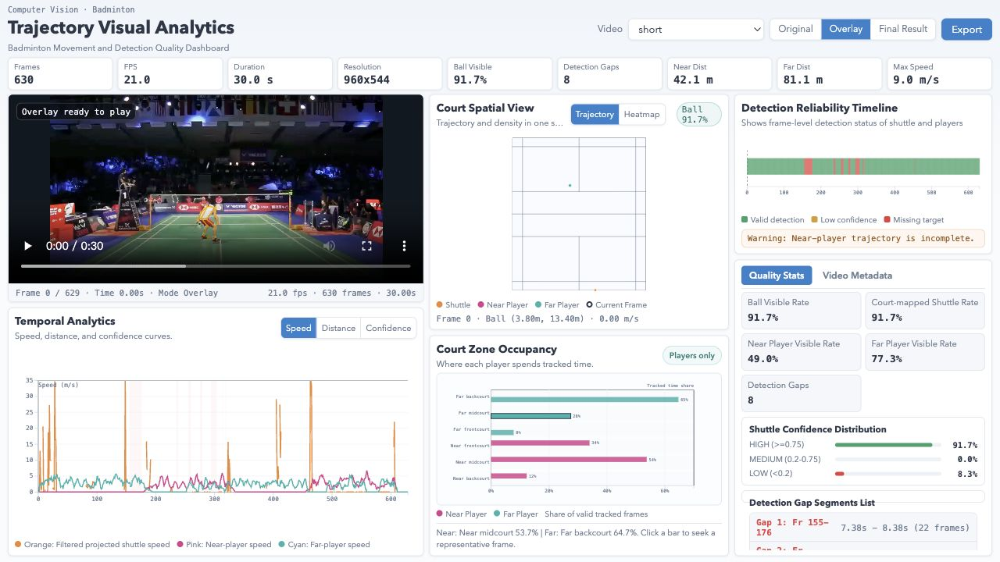

# 羽毛球比赛视频智能分析系统

**简体中文** · [English](README_EN.md)

[](https://www.python.org/)
[](https://pytorch.org/)
[](README_PORTABLE.md)
[](#license)
[](https://github.com/ychenfen/badminton-pipeline-repro/pulls)

把一段普通的羽毛球比赛视频，转换成带**运动员轨迹、移动速度、累计跑动距离、羽毛球飞行轨迹**的可视化分析视频，最后还能加上电影级"子弹时间"特效。新增 **Web 前端仪表盘**，提供交互式多维数据探索。

整套系统基于 **TrackNet（球检测） + YOLOv8s-pose（球员姿态） + ByteTrack（多目标跟踪） + 透视矫正**，支持 Windows NVIDIA CUDA、Apple Silicon MPS 与 CPU 自动加速。跨平台复制运行请先看 [README_PORTABLE.md](README_PORTABLE.md)。


---

## 这个项目解决了什么

市面上"开源羽毛球分析"项目通常只能做以下其中一项：
- 只检测球，没有球员分析
- 假设俯视机位（真实比赛视频几乎都是斜拍）
- 写死 Windows 路径，Mac/Linux 跑不通
- 阈值硬编码，在真实视频上静默失败（球检测率 0%）
- 没有可视化前端，分析数据只能在终端看

这个仓库包含跨平台入口 `run_pipeline.py`，一条命令跑完全流程（TrackNet → Overlay → FX → 前端数据导出），并配套 D3.js 交互式仪表盘。历史修复记录在 [HANDOVER.md](HANDOVER.md) 里。

---

## 效果展示

**输入**：原始比赛视频（960×544，21 fps，30 秒短样本）


**输出**：叠加分析后的视频，左侧统计面板 + 右上 Mini Court 俯视轨迹


**统计面板**（每个球员 4 项核心数据：当前速度 / 回合距离 / 回合最高 / 总距离）



**Mini Court**（俯视图轨迹：黄色 = 上半场球员，粉色 = 下半场球员，青色 = 球）



---

## Web 前端仪表盘

新增基于 D3.js 的交互式可视化仪表盘，支持 **9 个预分析视频** 的多维数据探索。



### 仪表盘布局

```
┌────────────────────────────────────────────────────────────────────┐
│  Badminton Visual Analytics        [Video ▾] [Original|Overlay|Final] [Export] │
├────────────────────┬──────────────────────┬────────────────────────┤
│                    │  Court Spatial View   │  Temporal Analytics    │
│   Video Player     │  [Trajectory|Heatmap] │  [Speed|Distance|Conf] │
│   + Frame Readout  │                       │                        │
│                    │  ┌──────────────────┐  ├────────────────────────┤
│                    │  │  Mini Court      │  │  Detection Timeline    │
│                    │  │  球员/球 俯视轨迹  │  │  逐帧检测状态可视化     │
│                    │  └──────────────────┘  ├────────────────────────┤
│                    │                        │  Quality Stats         │
│                    │  Court Zone Occupancy  │  / Video Metadata      │
│                    │  区域占有率热力图        │  (Tab 切换)             │
└────────────────────┴──────────────────────┴────────────────────────┘
```

### 核心功能

| 功能 | 说明 |
|---|---|
| **视频切换** | 下拉菜单切换 9 个视频片段（short + 8 个专业比赛片段） |
| **视频源切换** | Original / Overlay / Final Result 三种版本一键切换 |
| **帧级同步** | 任意图表上点击，视频自动跳转到对应帧 |
| **Mini Court** | 球场俯视图，支持轨迹模式和热力图密度模式切换 |
| **时序分析** | 速度 / 累计距离 / 检测置信度 三种指标曲线 |
| **检测可靠性时间线** | 逐帧显示球检测状态（绿 = 正常 / 橙 = 低置信度 / 红 = 缺失） |
| **区域占有率** | 6 个球场区域（前场/中场/后场 × 近端/远端）球员停留比例 |
| **统计卡片** | 帧数、FPS、时长、分辨率、球检出率、球员跑动距离、最高速度 |
| **质量面板** | 详细的检测质量指标 + 可点击的缺失检测段列表 |
| **数据导出** | 一键复制当前视频文件路径到剪贴板 |

### 启动前端

```bash
# 方式一：直接用浏览器打开（推荐）
open frontend/index.html

# 方式二：Python 起本地服务
cd frontend && python3 -m http.server 8080
# 然后浏览器访问 http://localhost:8080
```

前端数据通过 `scripts/tools/export_frontend_data.py` 从 `output/` 目录自动生成。`run_pipeline.py` 默认会在 Step 4 自动调用导出。

---

## 整体架构

```
原始视频.mp4
    │
    ▼  Step 1: TrackNet ─────────── 球检测（专门追小目标的连续帧热力图模型）
带球轨迹的视频 + 球坐标 CSV
    │
    ▼  Step 2: Overlay ──────────── YOLOv8s-pose + ByteTrack + Homography
叠加分析的视频 + stats.json + players.csv + motion.csv
    │
    ▼  Step 3: FX ────────────────── 子弹时间冻帧 + 慢动作 + 虚拟轨道相机
最终成品视频
    │
    ▼  Step 4: Export ────────────── 前端数据导出（manifest.json + 视频转码）
前端仪表盘可直接打开
```

四段独立运行，每段可以单独迭代。改一次面板字号、调一次跳变阈值、加一个新特效，都不需要从头重跑。

---

## 快速开始（30 秒短视频跑通）

### 1. 克隆仓库（含 LFS 大文件）

```bash
git lfs install     # 没装的话先 brew install git-lfs
git clone https://github.com/ychenfen/badminton-pipeline-repro.git
cd badminton-pipeline-repro
```

模型权重 `weights/TrackNet_best.pt`（130 MB）和样本视频通过 Git LFS 自动下载。

### 2. 装依赖

```bash
python3 -m pip install --user --index-url https://pypi.org/simple \
    numpy opencv-python pandas Pillow torch ultralytics tqdm \
    pycocotools parse lap
```

`pycocotools`、`parse`、`lap` 是 TrackNet/ByteTrack 的隐藏依赖，原 requirements 没列全，必装。

### 3. 标球场 4 角点

整个流程**唯一需要人工**的环节。运行：

```bash
python3 scripts/tools/select_court.py short.mp4
```

弹窗里**按顺序**点 4 下：左上 → 右上 → 右下 → 左下（球场长方形 4 角，不是球网）。点完按 q，终端会输出像 `--court_points "352,342,628,343,944,527,52,532"` 这样的字符串。

样本视频 `short.mp4` 的标准答案：

```
352,342,628,343,944,527,52,532
```

效果如图（黄色四边形贴合球场边线）：


### 4. 一键跑通全流程

统一入口 `run_pipeline.py`，跨平台自动选择 CUDA / MPS / CPU：

```bash
python3 run_pipeline.py \
  --input-video short.mp4 \
  --court-points "352,342,628,343,944,527,52,532"
```

这会依次执行 TrackNet → Overlay → FX → 前端数据导出，输出在 `output/short/` 目录下：

```
output/short/
├── short_ball.csv                    # 球的逐帧坐标
├── short_players.csv                 # 球员检测数据
├── short_motion.csv                  # 运动统计
├── short_overlay.mp4                 # 叠加分析视频
├── short_final.mp4                   # 最终成品视频
└── ...
```

设备设为 `auto` 时，Windows NVIDIA 环境自动使用 CUDA，Apple Silicon 环境自动使用 MPS。

旧版 Mac bash 入口仍兼容：

```bash
TRACKNET_VIS_THRESH=0.15 ./run_all_mac.sh \
  --input-video short.mp4 \
  --court-points "352,342,628,343,944,527,52,532" \
  --yolo-device mps
```

### 5. 看结果

```bash
# 播放叠加分析视频
open output/short/short_overlay.mp4

# 打开前端仪表盘
open frontend/index.html
```

### 6. 可选参数

```bash
# 启用球轨迹优化（跳变剔除 + 卡尔曼平滑 + 线性插值）
python3 run_pipeline.py \
  --input-video short.mp4 \
  --court-points "352,342,628,343,944,527,52,532" \
  --refine-ball

# 启用子弹时间特效
python3 run_pipeline.py \
  --input-video short.mp4 \
  --court-points "352,342,628,343,944,527,52,532" \
  --cinematic-fx

# 把统计面板画在视频上（默认不画，数据全在前端仪表盘）
python3 run_pipeline.py \
  --input-video short.mp4 \
  --court-points "352,342,628,343,944,527,52,532" \
  --embedded-panels
```

---

## 三段详解

### Step 1 — TrackNet（球检测）

**它解决的问题**：羽毛球只有几个像素、飞得快、容易模糊，单帧 YOLO 之类的检测器经常漏。

**它的思路**：一次吃 4 帧连拍，输出 4 张概率热力图（每个像素值 = 这里是球的概率）。利用连续帧的运动信息识别出模糊的球。类比：你看一张静态照片可能看不出蚊子在哪，但 4 张连拍就能看出"有什么东西在那一带飞过"。

**输出**：


视频上小圆圈是模型识别出的球轨迹。同时生成 CSV：

```csv
Frame,Visibility,X,Y
0,1,455,202
1,1,455,202
4,1,481,122
...
```

`Visibility=1` 表示这一帧检测到球，X/Y 是球在画面里的像素坐标。

**关键参数**：

| 参数 | 含义 | 推荐 |
|---|---|---|
| `--tracknet_file` | 模型权重 | `weights/TrackNet_best.pt` |
| `--tracknet_device` | 推理设备 | `auto`（Mac MPS；NVIDIA cuda；fallback cpu） |
| `--large_video` | 流式 dataloader | 长视频必须加 |
| `--tracknet_eval_mode` | `nonoverlap` / `weight` | `nonoverlap` 快 8 倍 |
| `--tracknet-threshold` | 二值化阈值 | **0.15**（默认已设好） |

### Step 2 — Overlay（球员检测 + 数据叠加）

整个项目 90% 的工程量在这一段，干 5 件事：

1. **YOLOv8s-pose** 检测每帧球员 + 17 个人体关键点（脚踝精确定位"足点"）
2. **ByteTrack** 维持球员 ID 跨帧不串
3. **Homography** 透视矫正：把斜拍画面里的梯形球场拉成俯视长方形
4. **MotionStats** 算每个球员的瞬时速度 / 累计距离 / 最高速度
5. **数据输出**：生成 stats.json / players.csv / motion.csv 供前端仪表盘消费

**透视矫正示意**：

```
画面里的梯形                标准球场坐标系（俯视）
                              (0, 0) ─────── (6.1, 0)
   TL ──── TR                    │              │
    \      /                     │              │
     \    /     ──→ Homography ─→│              │
      \  /                       │              │
   BL ──── BR                    │              │
                              (0, 13.4)─── (6.1, 13.4)
```

OpenCV 一行调用：

```python
H, _ = cv2.findHomography(court_quad, dst_rectangle)
```

之后任何脚点像素坐标都能投影到球场米制坐标，距离/速度计算跟机位无关。

**为什么要球员脚踝不用 bbox 中心**：bbox 中心是身体中心，离地有 1 米多高；脚踝在地面上，投影更准。`estimate_foot_point()` 优先取左右脚踝平均，置信度低时退到 bbox 底中点。

### Step 3 — FX（子弹时间特效）

电影《黑客帝国》Neo 躲子弹那个慢镜头围绕镜头转的镜头。这里是单机位轻量版：

- 选定一些时间点（"子弹时刻"，可手动 / 均匀分布 / 自动峰值检测）
- 在该时刻**冻帧** 28 帧，期间用虚拟相机做小幅度旋转 + 缩放
- 冻帧后接 **40 帧慢动作**（每帧重复 6 次，可选插值）
- 然后回到正常播放

默认不启用（保持前端帧级对齐）。加 `--cinematic-fx` 开启。

### Step 4 — 前端数据导出

`run_pipeline.py` 默认在 Step 4 自动调用 `scripts/tools/export_frontend_data.py`：

- 扫描 `output/` 下所有已完成分析的视频
- 计算 Homography 将像素坐标转为球场坐标
- 生成逐视频的 `quality.json`（检测质量指标、缺失段列表）
- 生成 `manifest.json`（视频元数据索引）
- 转码视频为 H.264 浏览器兼容格式
- 输出到 `frontend/public/data/` 目录

加 `--no-frontend-export` 跳过此步。

---

## 球轨迹优化

### `--filter-ball`：保守过滤

基于球场区域 + 运动评分过滤明显的误检点：

```bash
python3 run_pipeline.py \
  --input-video short.mp4 \
  --court-points "352,342,628,343,944,527,52,532" \
  --filter-ball
```

- 球场外区域（含 padding）的检出点视为误检
- 静止不动的连续检出点视为背景噪声
- ≤ 2 帧的空洞做线性插值填补
- 生成过滤报告 JSON

### `--refine-ball`：增强优化（推荐）

在 `--filter-ball` 基础上增加跳变剔除和更激进的插值：

```bash
python3 run_pipeline.py \
  --input-video short.mp4 \
  --court-points "352,342,628,343,944,527,52,532" \
  --refine-ball
```

- 逐帧跳变检测：相邻帧位移超过 `--ball-max-interp-step-px` 的视为 ID 串变
- 最大插值空洞扩展到 6 帧
- 支持 InpaintNet 校正（如果权重存在）
- 生成详细的校正报告

---

## 参数速查表

### 跑别的视频要改什么

1. `--input-video` 路径
2. 重新跑 `select_court.py` 标 `--court-points`
3. 如果机位完全不同（前场低位 / 侧场），可能要调 `--court_length_m`（全场 13.4，半场 6.7）

### 全长视频时间预估（M4 Pro）

| 阶段 | CPU | MPS（GPU） |
|---|---|---|
| TrackNet（13344 帧） | ~3 小时 | ~30 分钟 |
| Overlay | ~30 分钟 | ~10 分钟 |
| FX | ~5 分钟 | 同上 |
| 前端导出 | ~2 分钟 | 同上 |

**最大瓶颈是 TrackNet**。MPS 加速已支持（`--tracknet-device mps`）。改造细节见 [HANDOVER.md](HANDOVER.md) §10 Task P1.1。

---

## 常见问题

**Q：球完全检测不到（Visibility 全 0）**
A：检查 `--tracknet-threshold` 参数是否设了 0.15（默认已设好）。详见 [HANDOVER.md](HANDOVER.md) §6.1.4。

**Q：球员速度显示 24 m/s（比博尔特还快）**
A：跳变阈值过松导致 ID 串变被记进 max_speed。已修复为 `8.0 × dt + 0.05` 自适应阈值。详见 [HANDOVER.md](HANDOVER.md) §6.2.7。

**Q：中文显示成方块**
A：字体回退已加了 macOS PingFang.ttc。如果还报错，确认 `/System/Library/Fonts/PingFang.ttc` 存在。

**Q：球场轮廓画歪了**
A：`select_court.py` 点的顺序错了，必须 TL → TR → BR → BL。可加 `--draw_court_polygon` 让 overlay 视频里画出绿色四边形检查。

**Q：`ModuleNotFoundError: pycocotools / parse / lap`**
A：原 requirements.txt 没列全，按本文档"装依赖"那条命令补上。

**Q：前端仪表盘打不开 / 没有数据**
A：确认 `frontend/public/data/manifest.json` 存在。运行 `run_pipeline.py` 会自动导出前端数据，或手动运行 `python3 scripts/tools/export_frontend_data.py`。

更多问题排查：[HANDOVER.md](HANDOVER.md) §8。

---

## 项目结构

```
badminton-pipeline-repro/
├── README.md                       # 本文件（中文快速上手）
├── HANDOVER.md                     # 1500+ 行详细交接文档（含 AI agent 任务包）
├── README_MAC.md                   # macOS 启动笔记（原作者）
├── README_EN.md                    # English README
├── README_PORTABLE.md              # 跨平台运行指南
├── CHAIN_EVIDENCE.md               # 原作者解释为什么这条 pipeline 是"最可信"链
├── run_pipeline.py                 # 跨平台统一入口（TrackNet → Overlay → FX → Export）
├── run_all_mac.sh                  # macOS 一键脚本（旧版，仍兼容）
├── run_all.ps1                     # Windows PowerShell 一键脚本
├── run_all_videos.py               # 批量处理多视频
├── requirements_repro.txt          # Python 依赖
│
├── weights/                        # 模型权重（LFS）
│   ├── TrackNet_best.pt            # 球检测（130 MB）
│   └── yolov8s-pose.pt             # 球员姿态（23 MB）
│
├── frontend/                       # Web 前端仪表盘
│   ├── index.html                  # 主页面
│   ├── favicon.svg
│   ├── styles/                     # 样式
│   │   ├── base.css                # 设计 tokens + 基础样式
│   │   ├── layout.css              # 三栏响应式布局
│   │   └── charts.css              # 图表专用样式
│   ├── src/
│   │   ├── main.js                 # 入口 + 应用状态管理
│   │   ├── dataLoader.js           # 数据加载（JSON/CSV 并行请求）
│   │   ├── videoSync.js            # 视频帧级同步
│   │   ├── charts/
│   │   │   ├── miniCourt.js        # 球场俯视图（轨迹/热力图双模式）
│   │   │   ├── speedChart.js       # 速度/距离/置信度时序曲线
│   │   │   ├── heatmapLayer.js     # Canvas 热力图层
│   │   │   ├── zoneOccupancy.js    # 区域占有率柱状图
│   │   │   ├── statCards.js        # 统计卡片 + 质量面板
│   │   │   ├── trajectoryChart.js  # 轨迹图表
│   │   │   └── visibilityTimeline.js  # 检测可靠性时间线
│   │   └── vendor/d3.min.js        # D3.js v7
│   └── public/data/                # 前端数据（pipeline 自动生成）
│       ├── manifest.json           # 视频索引
│       └── videos/                 # 逐视频分析数据
│
├── scripts/
│   ├── tracknet_runtime/           # Step 1: TrackNet
│   │   ├── predict.py              # 入口（支持 MPS 加速）
│   │   ├── model.py                # 网络结构（U-Net 风格）
│   │   ├── dataset.py              # 数据加载
│   │   └── utils/general.py        # HEIGHT=288, WIDTH=512 等常量
│   │
│   ├── overlay/
│   │   └── overlay_player_analytics.py   # Step 2: 1340+ 行核心
│   │
│   ├── fx/
│   │   └── video_fx_bullet_time.py       # Step 3: 特效
│   │
│   └── tools/                      # 工具集
│       ├── select_court.py         # 交互式标球场角点
│       ├── export_frontend_data.py # 前端数据导出
│       ├── mask_tracknet_input.py  # TrackNet 输入遮罩预处理
│       ├── smooth_ball_csv.py      # 球轨迹保守过滤
│       ├── refine_ball_csv.py      # 球轨迹增强优化
│       ├── audit_ball_quality.py   # 球检测质量审计
│       ├── check_outputs.py        # 输出文件校验
│       ├── transcode_browser_video.py  # 浏览器兼容转码
│       └── ...
│
├── output/                         # Pipeline 输出（自动生成）
│   ├── short/                      # 30 秒样本分析结果
│   ├── pro_match17_*/              # 专业比赛片段分析
│   ├── pro_match19_*/              # 专业比赛片段分析
│   ├── ball_quality_summary.csv    # 质量评分与分级汇总
│   └── ...
│
└── docs/images/                    # README 配图
```

---

## 这个项目踩过的坑（精简版）

| 问题 | 现象 | 修复位置 |
|---|---|---|
| TrackNet 球检测 0% | csv 全 0 | `predict.py:35` 阈值 0.5 → 环境变量参数化 |
| 球员速度 24 m/s | 面板数字离谱 | `overlay_player_analytics.py:602` 阈值 1.2m → `8×dt+0.05` |
| 中文方块 | macOS 字体路径 | `overlay_player_analytics.py:18-27` 字体回退表 |
| 面板信息冗余 | 每球员 7 个数字 | 砍到 4 个核心 |
| 球场 quad 错位 | 距离速度全错 | `select_court.py` 重新人工标 |
| 跳变未被过滤 | 球轨迹离群点 | `refine_ball_csv.py` 跳变剔除 + 插值 |

完整变更清单：[HANDOVER.md](HANDOVER.md) §9。

---

## 后续工作

[HANDOVER.md](HANDOVER.md) §10 列了 12 个详细任务（P0-P3），每个都按"背景 / 目标 / 步骤 / 涉及文件 / 验证 / 已知陷阱"格式写好，AI agent（Codex / Cursor / Claude）可以直接挑一个任务从那里起步。

当前进度与后续方向：

```
已完成：
  ✅ P0.1 默认值写入 sh
  ✅ P0.2 清理临时文件
  ✅ TrackNet 阈值参数化
  ✅ 跳变阈值动态化
  ✅ MPS 加速支持（TrackNet + YOLO）
  ✅ 球轨迹过滤与优化（--filter-ball / --refine-ball）
  ✅ 前端仪表盘（D3.js 交互式可视化）
  ✅ 前端数据自动导出
  ✅ 批量视频处理
  ✅ 跨平台统一入口 run_pipeline.py

待推进：
  P1.2 缓存 detections.json      → 3-5 小时
  P1.3 YOLO 跳帧检测优化          → 1-2 小时
  P2.2 击球点 + 自动回合分割       → 4-6 小时
  P2.3 Mini Court 视觉增强        → 1-2 小时
  P3.1 Gradio Web UI（上传+标点+跑）→ 1-2 天
  P3.2 多机位适配                  → 1-2 天
  P3.3 数据导出 + PDF 报告         → 4-6 小时
```

---

## 致谢

- TrackNet 模型来自 [TrackNetV3](https://github.com/qaz812345/TrackNetV3)
- YOLOv8 来自 [Ultralytics](https://github.com/ultralytics/ultralytics)
- ByteTrack 跟踪算法 [ByteTrack](https://github.com/ifzhang/ByteTrack)
- 前端可视化使用 [D3.js](https://d3js.org/)
- 样本视频出自 YouTube 频道 POGBADMINTON

---

## License

代码部分 MIT。模型权重和样本视频按各自原始来源的 license 使用，仅供学习研究。

---

## 引用

如果这个项目帮到了你的研究、论文、或产品，star 是最简单的支持方式。论文引用：

```bibtex
@misc{badminton_pipeline_repro,
  author       = {ychenfen},
  title        = {Badminton Match Video Analytics Pipeline},
  year         = {2026},
  howpublished = {\url{https://github.com/ychenfen/badminton-pipeline-repro}}
}
```

如果你做了改进或衍生项目，欢迎提 PR / Issue / Discussion。

---

## 关键词

羽毛球, 视频分析, 图像识别, 运动分析, 计算机视觉, 目标检测, 多目标跟踪, 球员追踪, 球轨迹, 透视变换, 单应性矩阵, 子弹时间, 慢动作, 体育数据分析, AI 教练, 羽毛球训练, 比赛复盘, 战术分析, OpenCV, PyTorch, YOLOv8, TrackNet, ByteTrack, Apple Silicon, M4 Pro, MPS, macOS, D3.js, 数据可视化, Web 仪表盘, badminton, sports analytics, video analytics, computer vision, object tracking, shuttle detection, player tracking, court homography, bullet time, data visualization, dashboard.
